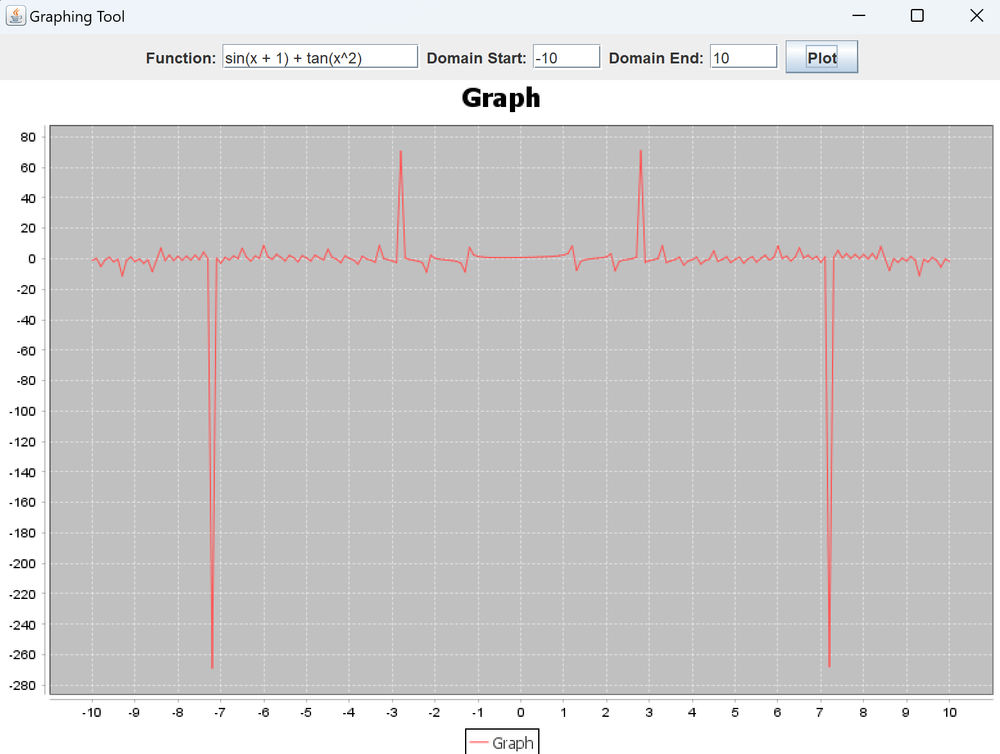

# CalculatorGUI Project

## Overview

The CalculatorGUI project is a powerful and accurate calculator application with a graphical user interface (GUI) built using Java AWT / Swing. It supports basic arithmetic operations along with several additional mathematical functions. The project includes the following classes:

1. `CalculatorGUI` - The main GUI class for the calculator.
2. `Calculator` - A utility class that handles expression parsing, conversion to postfix notation, and evaluation.
3. `CalculatorTester` - A command-line tester for the `Calculator` class, useful for testing purposes.
4. `GraphingTool` - A Swing-based graphing tool for plotting mathematical functions.


## Features

- Supports basic arithmetic operations: addition (`+`), subtraction (`-`), multiplication (`*`), and division (`/`).
- Supports exponentiation (`^`) and parentheses for grouping expressions.
- Additional mathematical functions: square root (`sqrt`), logarithm (`log`), trigonometric functions (`sin`, `cos`, `tan`), and factorial (`!`).
- Dark mode GUI for a modern appearance.
- Input validation via keyboard and button panels and thorough error handling.
- History panel allowing for quick retrieval of past expressions.
- Graphing Tool: Plot mathematical functions graphically using the integrated graphing tool!
## Usage

### Prerequisites

- Java Development Kit (JDK) 8 or higher.
- An IDE or text editor for Java development

### Running the GUI Application

1. **Clone the repository:**
   ```bash
   git clone https://github.com/your-username/calculator-gui.git
   cd calculator-gui

2. **Compile and run the `CalculatorGUI` class**
    ```bash
    javac CalculatorGUI.java
    java CalculatorGUI

3. The calculator GUI will launch. You can use either the on-screen buttons or your keyboard to enter expressions. Press `Enter` or click `=` to evaluate the expression. Use the "Graph" button to launch the graphing tool and plot your own mathematical functions.
